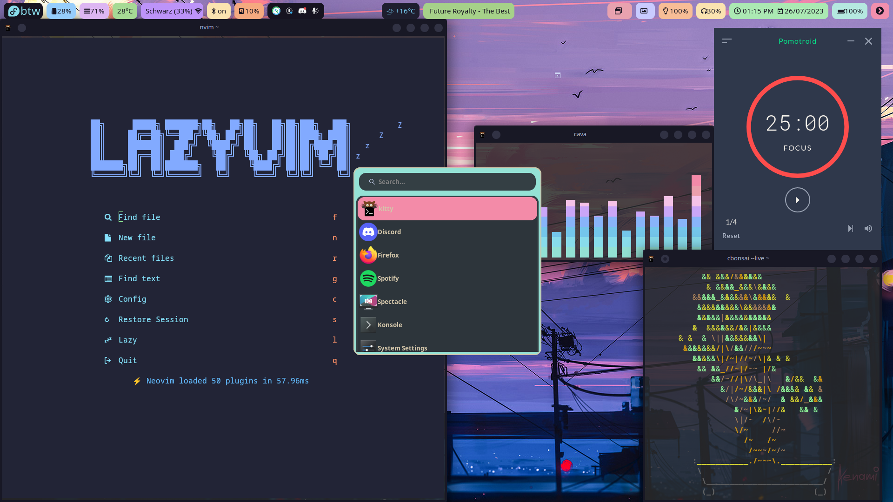
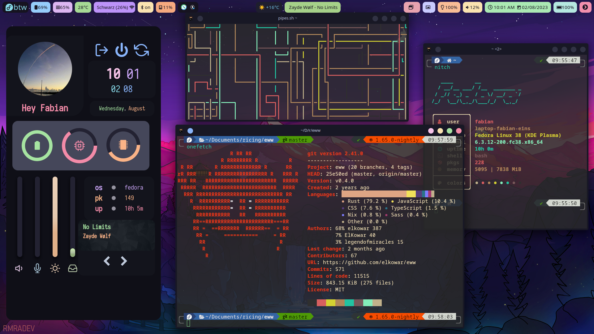
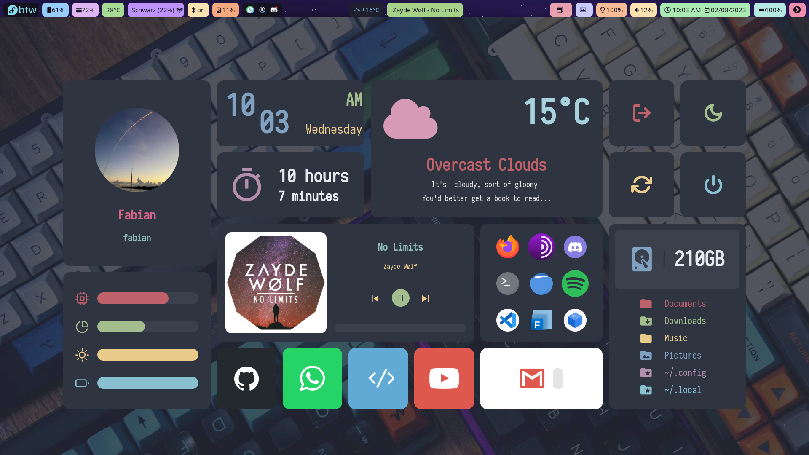
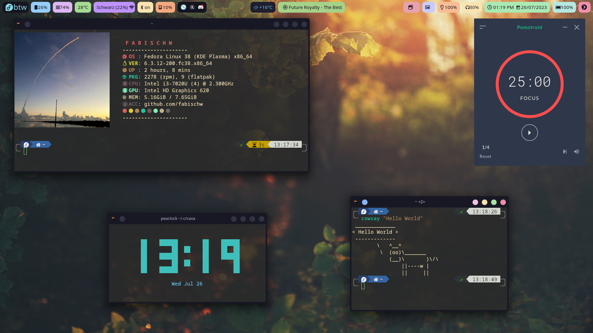

    <h1> fabischw's Dot Files 📁</h1>
    

|||
| --- | --- |
|||

# 🚧 REPOSITORY IS UNDER CONSTRUCTION 🚧
 component      | status 
 --             | -- 
 [.config folder](./config/) | **incomplete**
 [installation guide](./INSTALLATION.md) | **missing**
 [LICENSE](./LICENSE) | **missing**
 [main README](./README.md) | finished
 [wallpaper reference](./wallpapers.md) | **missing**
 

<table align="center">
   <tr>
      

         ⚠️ WARNING ⚠️
      

   </tr>
   <tr>
   <td align="center">

     USE AT YOUR OWN RISK
     THIS SETUP IS MESSY AND CONFUSING
     SOME COMPONENTS MIGHT NOT WORK ON YOUR SYSTEM
     THIS SETUP IS CONFIGURED FOR A 1920x1080 RESOLUTION

   </td>
   </tr>
</table>

### Software Overview

 Software| Used
 ---     | ---
Distro   | [Fedora 38 (KDE)](https://fedoraproject.org/spins/kde/)
Terminal | [kitty](https://sw.kovidgoyal.net/kitty/)
Shell    | [fish](https://fishshell.com/)
Bar      | [Waybar](https://github.com/Alexays/Waybar)
Widgets  | [Elkowars Wacky Widgets - EWW](https://github.com/elkowar/eww)

 

Software in depth + sources

  - Some of the components of my desktop have been forked from other dotfile repos, you can find these and other sources below
  - Most of the changes done are non-aesthetic and fundamentaly change the way some of the components function, this makes setup scripts from the source repos incompatible, for installation and further customizations refer to [INSTALLATION](./INSTALLATION.md)
  - the software with no further description is used As-is without any changes done to them
  - In case the dotfile repos I've forked off get deleted, forks of all three can be found on my github

  #### [Desktop Enviroment - KDE Plasma (Wayland)](https://kde.org/):
  - system theme: [Catppuccin mocha, peach accent color](https://github.com/catppuccin/kde)
  - window decorations: [Catppuccin Mocha Classic Aurorae](https://store.kde.org/p/2023180)

  ### GUI applications

  #### [Dashboard & Sideboard - EWW](https://github.com/elkowar/eww):
  - dashboard config forked  from [here](https://github.com/adi1090x/widgets), modified mainly internals(scripts to get data etc.); [modified config](./config/eww/dashboard/)
  - leftbar config forked  from [here](https://github.com/saimoomedits/eww-widgets), modified both internals(scripts to get data etc.) and aesthetics(colors); [modified config](./config/eww/leftbar_old/)

  #### [Top Bar - Waybar](https://github.com/Alexays/Waybar):
  - config forked from [here](https://github.com/theCode-Breaker/riverwm/tree/main/waybar), modified both internals(scripts to get data, widget contents and actions) and aesthetics(layout and number of widgets); [modified config](./config/waybar/)

  #### [Logout Menu - Wlogout](https://github.com/ArtsyMacaw/wlogout)
  - 100% [custom config](./config/wlogout/)

  #### [App Launcher - Wofi](https://hg.sr.ht/~scoopta/wofi)
  - 100% [custom config](./config/wofi/)

  #### [Browser - Firefox](https://www.mozilla.org/en-US/firefox/new/):
   customized official config for [NightTab](https://github.com/zombieFox/nightTab)

  #### [Pomodoro Timer - Pomotroid](https://splode.github.io/pomotroid/)

  ### TUI applications:

  #### [text editor - vim](https://www.vim.org/)
  - [lazyvim default](https://www.lazyvim.org/)

  #### [video player - mpv](https://mpv.io/)

  #### [fish prompt - tide](https://github.com/IlanCosman/tide)

  #### [Terminal system monitor - bottom](https://github.com/ClementTsang/bottom)

  #### [System information tool - neofetch](https://github.com/dylanaraps/neofetch)
  - 100% [custom config](./config/neofetch/)

  #### [Repository information tool - onefetch](https://github.com/o2sh/onefetch)

  #### [Audio Visualizer - cava](https://github.com/karlstav/cava)
  - [catppuccin theme for cava](https://github.com/catppuccin/cava)

  

### Hotkeys
Please keep in mind these hotkeys assume you use a german keyboard layout

Hotkey  | function
 ------ | -----
Alt + L | open logout menu
Alt + S | start wofi launcher in desktop mode
Alt + A | start wofi launcher in run mode
Alt + D | KDE overview
Alt + 0 | launch / close EWW dashboard
Alt + B | launch / close EWW sideboard
Alt + ß | kill all EWW widgets
Alt + T | open terminal (kitty)

#### INSTALLATION

 🚧 Installation guide and script as well as config files are not yet ready for publication 🚧
